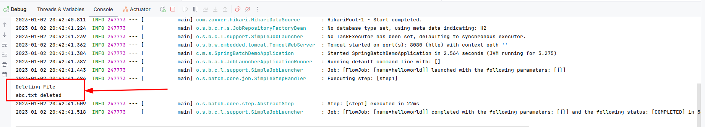

# Spring Boot Batch Process Example

This is a simple example of a Spring Boot Batch Process.

## Requirements
- Java 11
- Maven
- Web Browser(Mozilla Firefox or Google Chrome)

## Running the application locally
- Clone the repository
- Run `mvn spring-boot:run` from the root directory
- This process remove abc.txt file from the /home/mehmet/Desktop folder
- Open web browser and navigate to `http://localhost:8080/invokejob`

## Result

